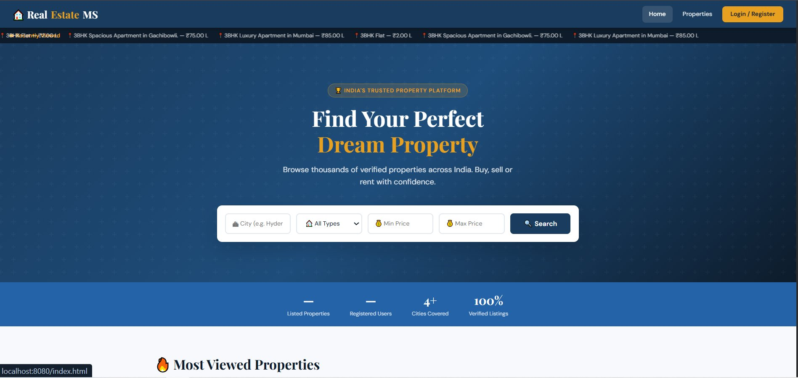
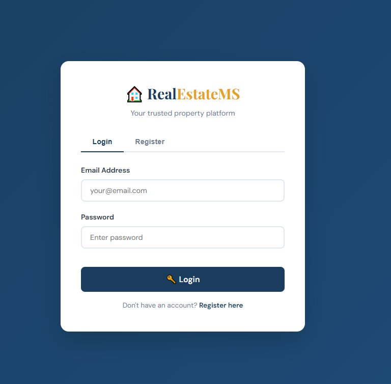
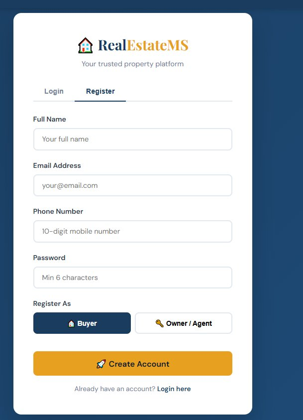
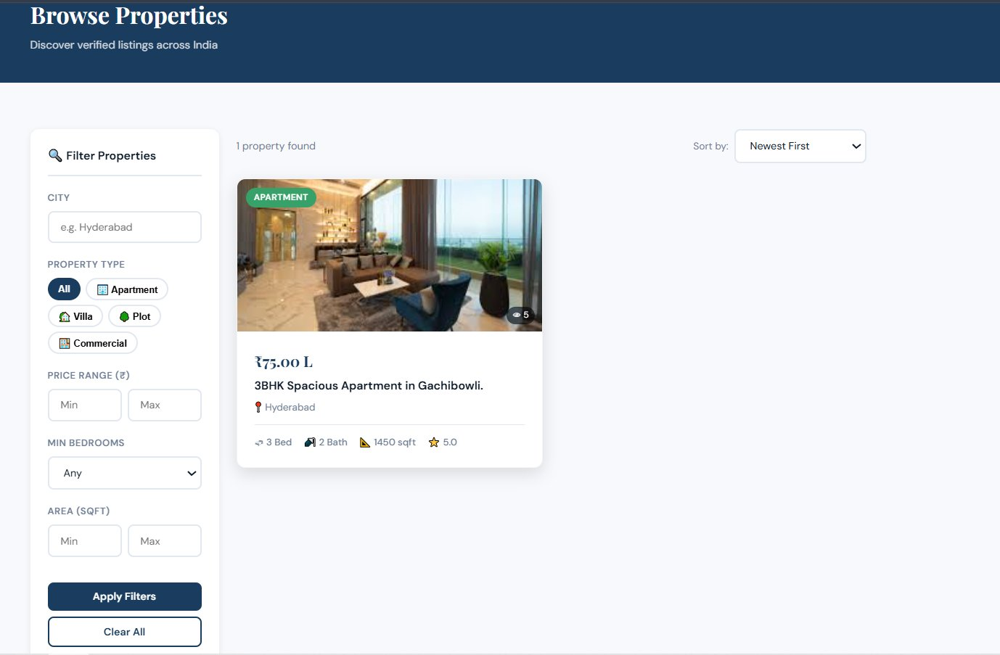
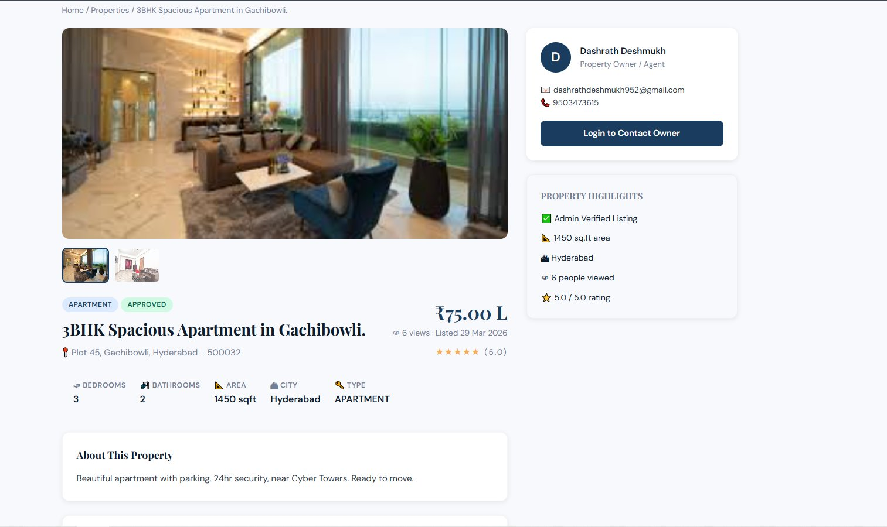
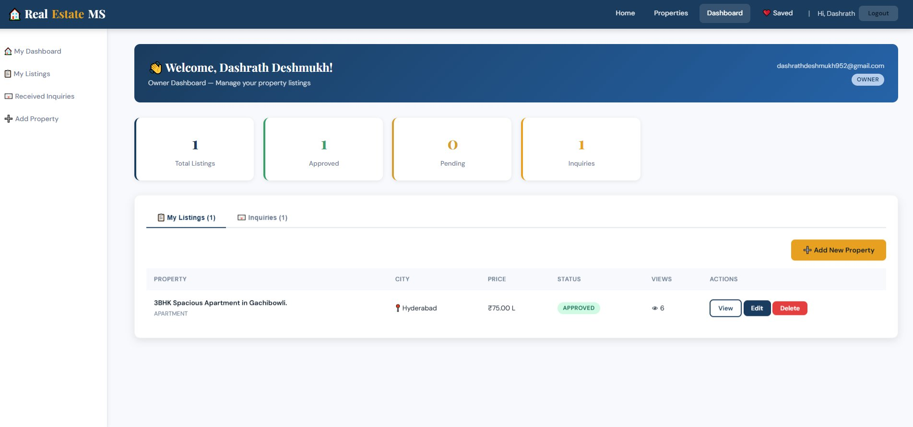
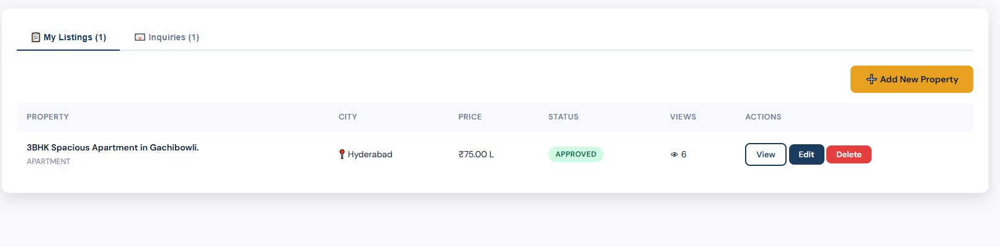
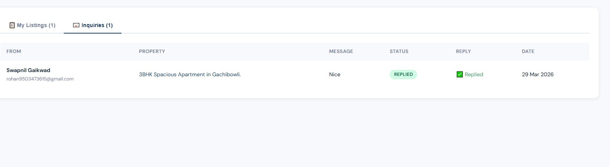
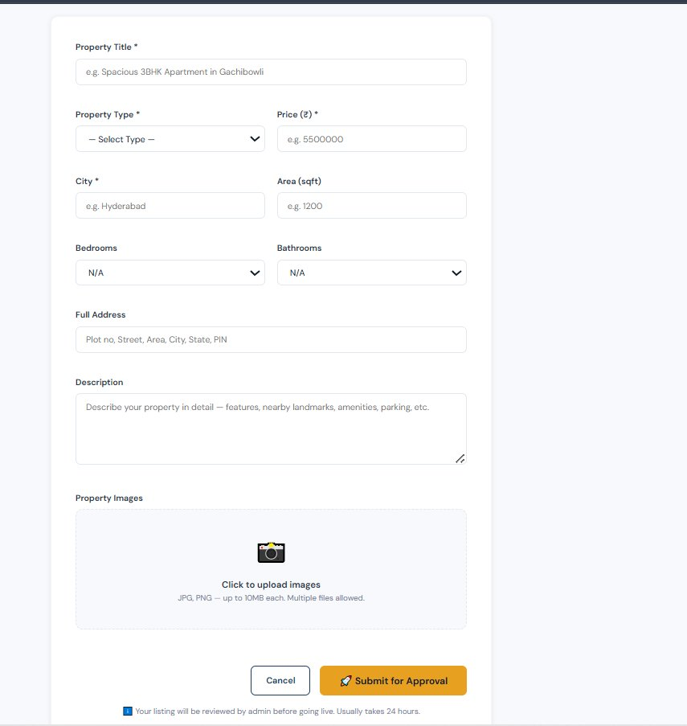
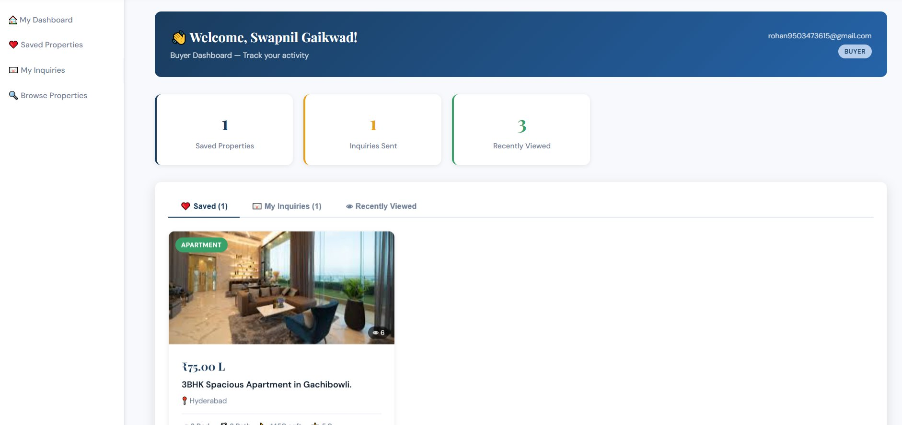

# 🏠 Real Estate Property Management System

<div align="center">


**A full-stack Real Estate web application inspired by MagicBricks & 99acres**

*MCA Final Year Project — Swami Ramanand Teerth Marathwada University, Nanded*

</div>

---

## 📸 Screenshots

### 🏠 Home Page

> Hero section with search bar, scrolling ticker, stats and featured listings

---

### 🔐 Login Page

> JWT-based secure login with Email and Password

---

### 📝 Register Page

> Register with Name, Email, Phone, Password and Role (Buyer / Owner)

---

### 🏘️ Browse Properties

> Filter sidebar — City, Property Type, Price Range, Bedrooms, Area and Sort options

---

### 🏡 Property Detail

> Image gallery, specifications, owner card, highlights, reviews and ratings

---

### 👨‍💼 Owner Dashboard

> Stats — Total Listings, Approved, Pending, Inquiries with My Listings tab

---

### 📋 Owner My Listings

> Property table with Status (APPROVED/PENDING), Views, Edit and Delete buttons

---

### 📧 Received Inquiries

> Buyer name, email, message, REPLIED status and date

---

### ➕ Add Property

> Property form with all fields and multi-image upload

---

### 🛒 Buyer Dashboard

> Saved Properties, Inquiries Sent, Recently Viewed stats and tabs

---

## 📖 About the Project

The **Real Estate Property Management System** digitizes property transactions — owners list properties, buyers search and inquire, admins verify listings.

> ⚠️ **Note:** Credentials are intentionally NOT included. Manual configuration required.

---

## ✨ Features

- 🔐 **JWT Authentication** — Secure login with BCrypt password encryption
- 👥 **3 Roles** — Admin, Owner, Buyer with role-based access
- 🏠 **Property Management** — Add/Edit/Delete with multi-image upload
- 🔍 **Advanced Search** — City, Type, Price, Bedrooms, Area filters
- ❤️ **Favorites** — Wishlist with duplicate prevention
- 💬 **Inquiry System** — PENDING → READ → REPLIED status tracking
- 📧 **Email Notifications** — Auto email on inquiry, approval, reply
- ⭐ **Reviews & Ratings** — 5-star rating system
- 📊 **Admin Dashboard** — Analytics, approvals, user management

---

## 🛠️ Tech Stack

| Layer | Technology | Version |
|-------|-----------|---------|
| Backend Framework | Spring Boot | 3.2.0 |
| Language | Java | JDK 17 |
| Database | MySQL | 8.0 |
| ORM | Hibernate / Spring Data JPA | 6.x |
| Security | Spring Security + JWT (JJWT) | 0.11.5 |
| Email | Spring Mail (Gmail SMTP) | - |
| Build Tool | Apache Maven | 3.x |
| Frontend | HTML5, CSS3, JavaScript ES6+ | - |
| UI Framework | Bootstrap | 5.x CDN |

---

## ⚙️ Setup & Installation

### Step 1 — Clone Repository
```bash
git clone https://github.com/Dashrath9503/real-estate-management-system.git
cd real-estate-management-system
```

### Step 2 — Create MySQL Database
```sql
CREATE DATABASE realestate_db CHARACTER SET utf8mb4;
```

### Step 3 — Configure application.properties
```properties
spring.datasource.username=YOUR_MYSQL_USERNAME
spring.datasource.password=YOUR_MYSQL_PASSWORD
app.jwt.secret=YOUR_OWN_SECRET_KEY_MIN_32_CHARS
spring.mail.username=YOUR_GMAIL@gmail.com
spring.mail.password=YOUR_16_DIGIT_APP_PASSWORD
```

### Step 4 — Gmail App Password
```
myaccount.google.com/apppasswords → Create → Copy 16-digit password
```

### Step 5 — Create Admin Account
```sql
-- After registering normally:
UPDATE users SET role = 'ADMIN' WHERE email = 'your-email@gmail.com';
```

---

## 🚀 Running the Application

```bash
# Maven
mvn clean install
mvn spring-boot:run
```

| Page | URL |
|------|-----|
| Home | http://localhost:8080 |
| Login | http://localhost:8080/pages/login.html |
| Properties | http://localhost:8080/pages/listings.html |
| Dashboard | http://localhost:8080/pages/dashboard.html |
| Admin | http://localhost:8080/pages/admin-dashboard.html |

---

## ⚠️ Common Errors & Fixes

| Error | Fix |
|-------|-----|
| Connection refused | Start MySQL service |
| Email auth failed | Setup Gmail App Password |
| 403 Forbidden | Clear localStorage, re-login |
| Port 8080 in use | Add `server.port=8085` |
| Admin access denied | Run SQL UPDATE for role |
| JWT expired | Clear localStorage, re-login |

---

## 🔮 Future Scope

- 🗺️ Google Maps Integration
- 💳 Razorpay Payment Gateway
- 💬 Real-time Chat (WebSocket)
- 📱 React Native Mobile App
- 🤖 AI Price Prediction
- 🌐 Cloud Deployment (AWS/Railway)

---

## 👨‍💻 Developer

**Dashrath Deshmukh**
- 🎓 MCA Final Year — SRTMU, Nanded (2025-2026)
- 💼 GitHub: [@Dashrath9503](https://github.com/Dashrath9503)
- 🔗 LinkedIn: [dashrath-deshmukh](https://linkedin.com/in/dashrath-deshmukh-9a732b368/)
- 📧 Email: rohan9503473615@gmail.com

---

<div align="center">

⭐ **If you found this helpful, please give it a star!** ⭐

*Made with ❤️ using Spring Boot & Java*

</div>